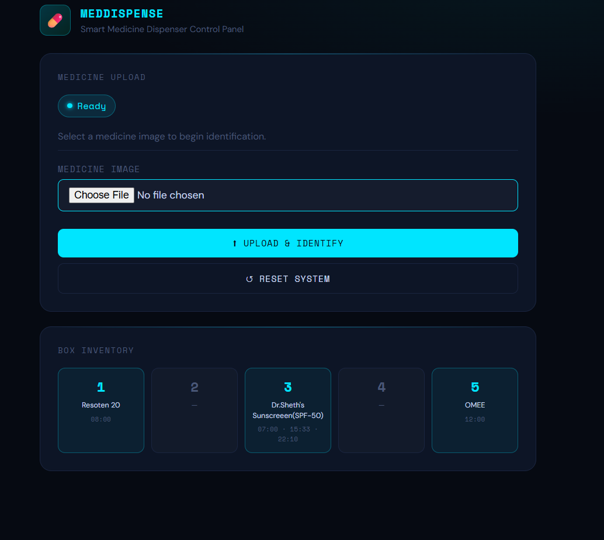
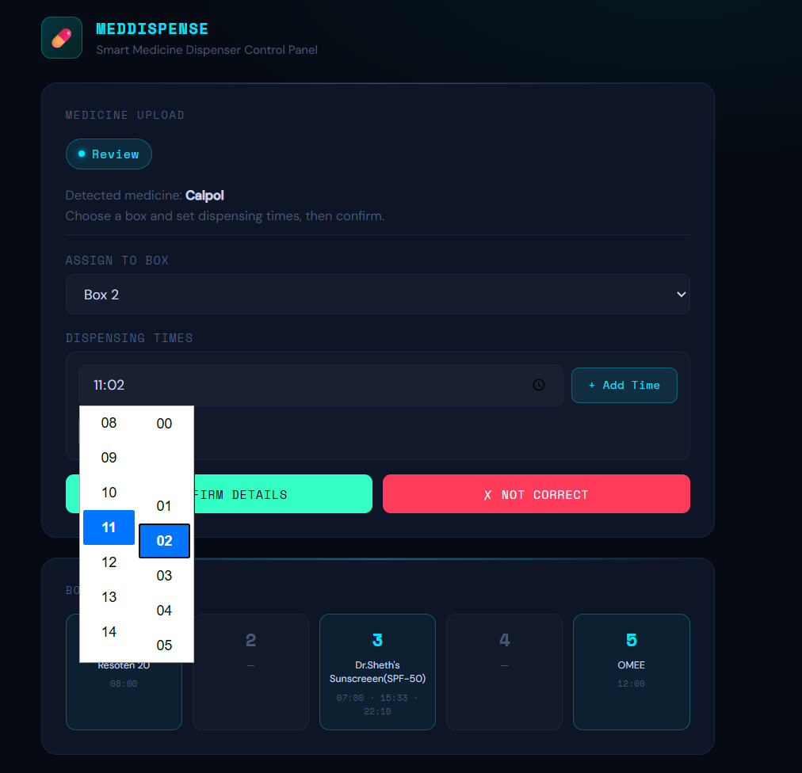
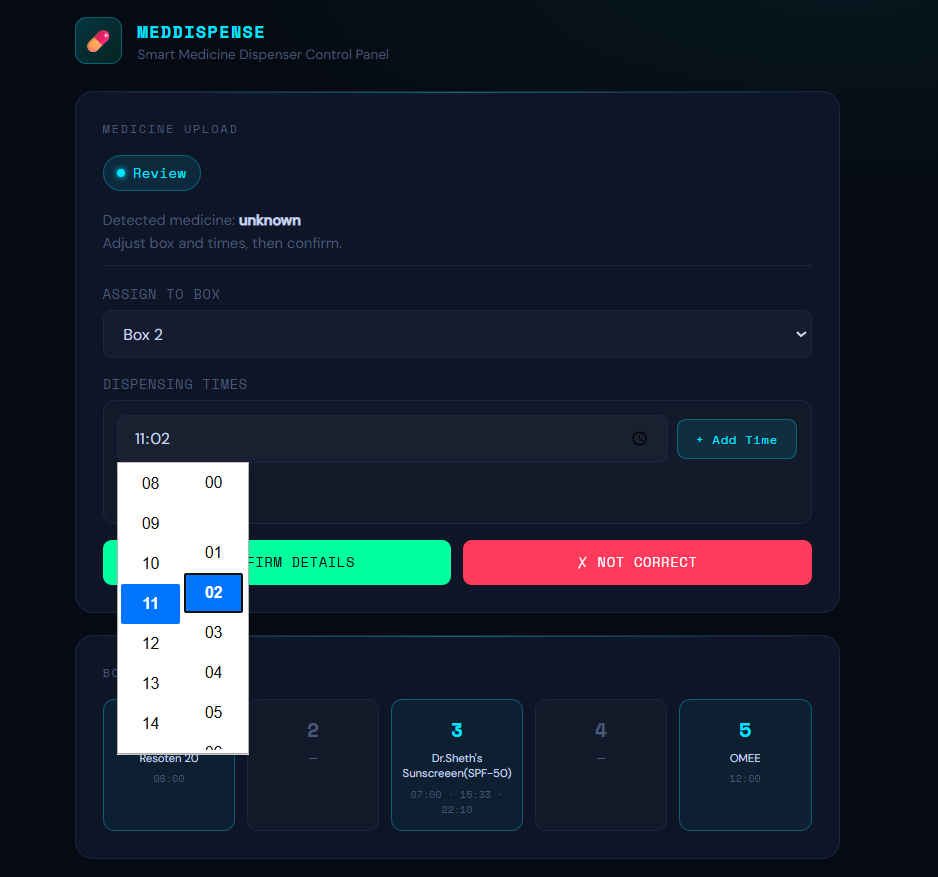
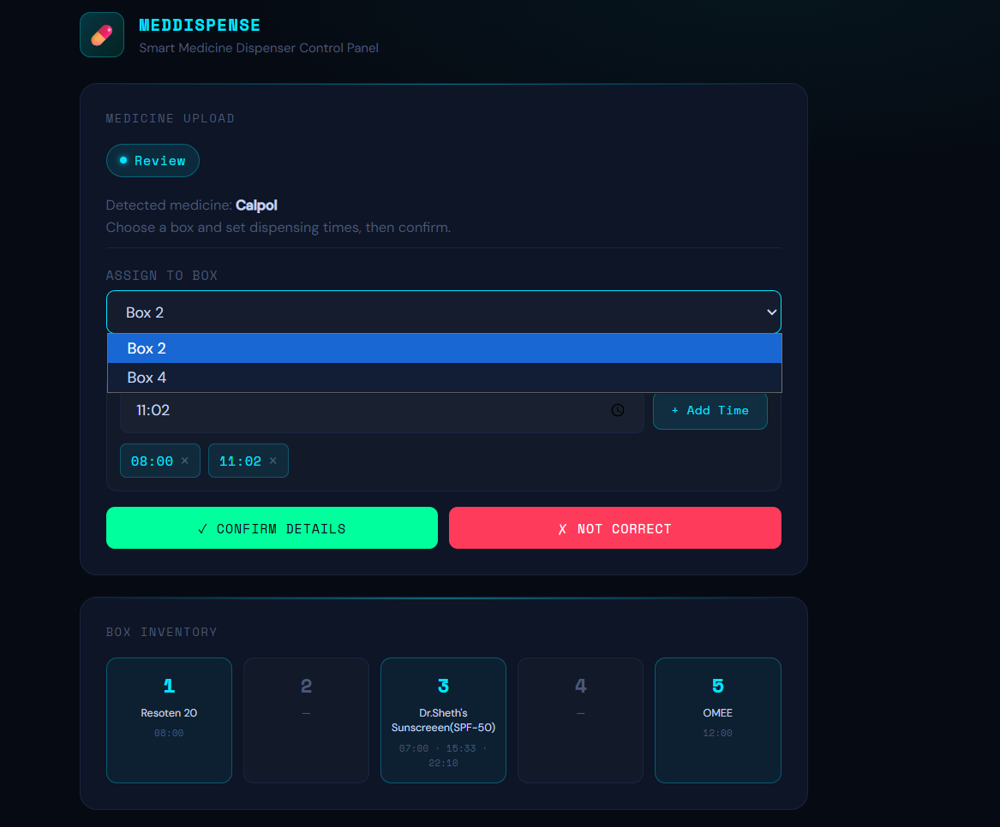
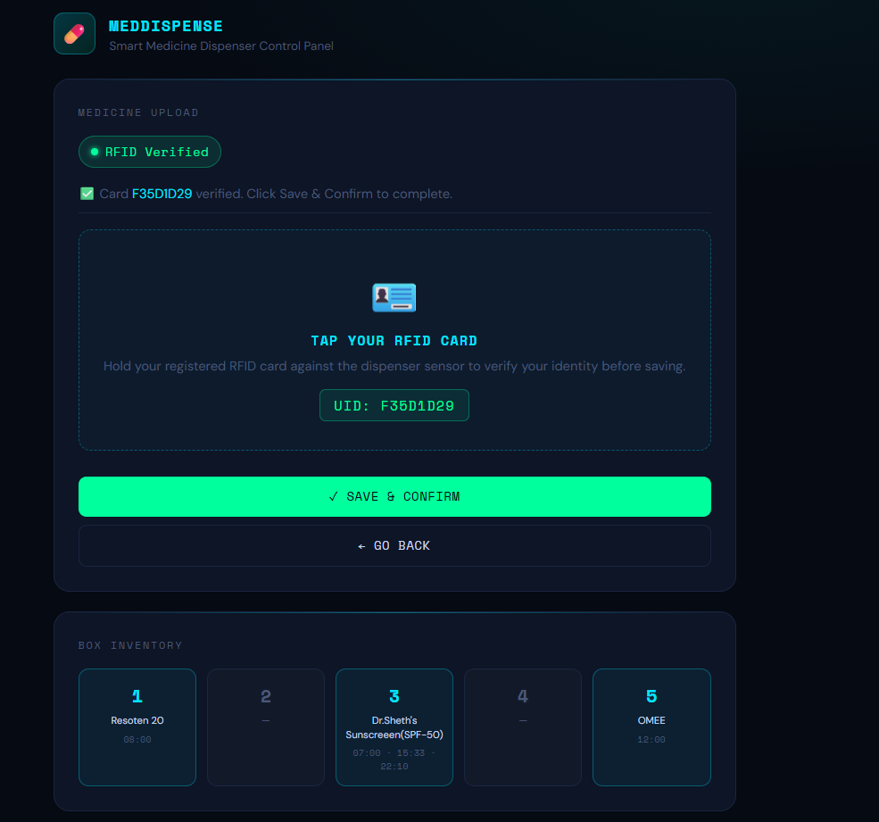
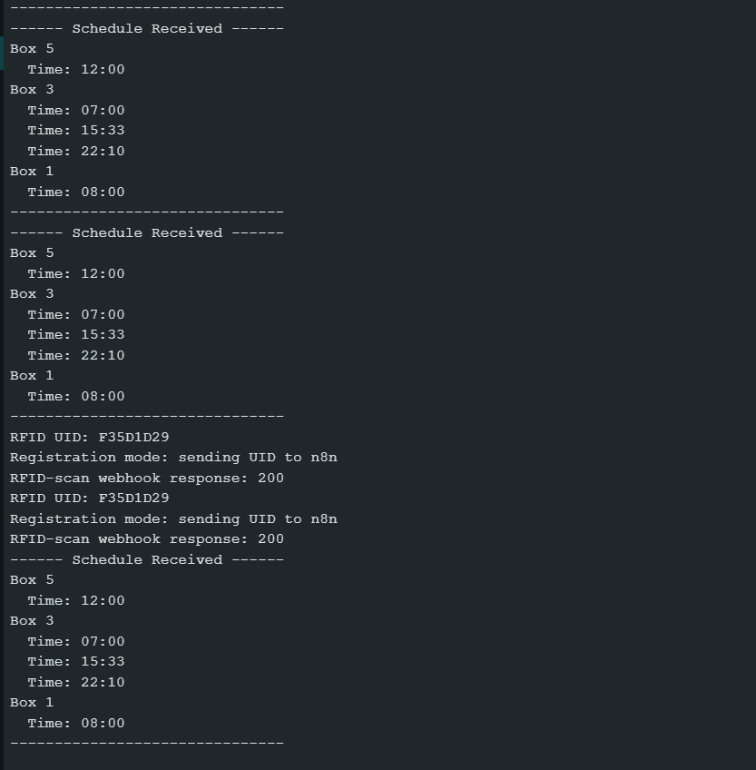
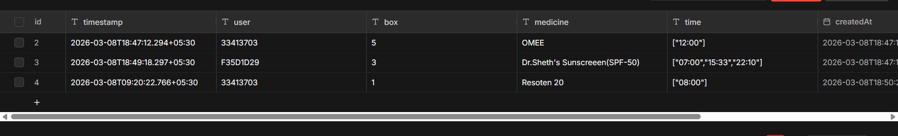
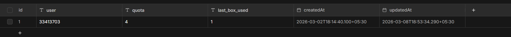
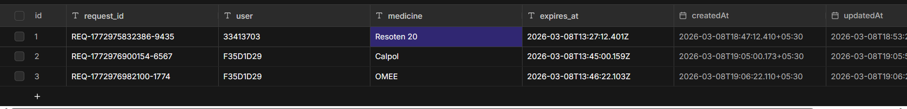
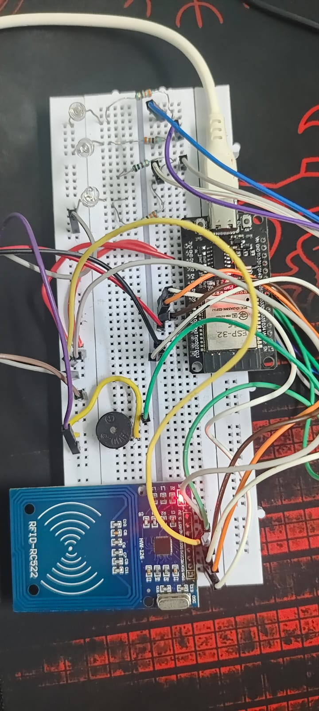

# 💊 MedDispense — Smart Medicine Dispenser

A smart medicine dispenser system built with an ESP32, n8n automation, and a web-based control panel. The system identifies medicines from images using AI, assigns them to dispensing boxes, schedules reminders, and verifies the user's identity via RFID before dispensing.

> **Note:** This project is currently in progress. Registration, scheduling, and alarm buzzing are fully functional. The physical dispensing mechanism is under development — LEDs currently simulate box dispensing.

---

## 📸 Screenshots

| Dashboard | Medicine Identification |
|---|---|
|  |  |

| Time Selection | Box Selection |
|---|---|
|  |  |

| RFID Verified | ESP32 Serial Monitor |
|---|---|
|  |  |

| Medicine Table | User Table |
|---|---|
|  |  |

| Request Table | Hardware |
|---|---|
|  |  |

---

## ✅ Features (Completed)

- 📷 **AI Medicine Identification** — Upload a photo of a medicine and the system identifies it automatically using an AI agent in n8n
- 📦 **Box Assignment** — Assign identified medicines to one of 5 dispensing boxes
- ⏰ **Dispensing Schedule** — Set multiple dispensing times per box using a tag-based time picker
- 🪪 **RFID Authentication** — User must tap their registered RFID card to confirm registration and to collect medicine
- 🔔 **Buzzer Reminder** — ESP32 buzzes at scheduled times to remind the user to take their medicine
- 🔒 **RFID-locked Dispensing** — Only the registered RFID card can unlock a box during its dispensing window
- 📊 **Live Inventory** — Web frontend shows real-time box status fetched from n8n datatable
- ✏️ **Box Editing** — Replace a box's medicine by uploading a new image via the inventory panel

---

## 🚧 In Progress

- Physical dispensing mechanism (servo/motor) — currently simulated with LEDs
- Hardware enclosure and box assembly

---

## 🛠️ Tech Stack

| Component | Technology |
|---|---|
| Microcontroller | ESP32 |
| RFID Reader | MFRC522 |
| Backend / Automation | n8n (self-hosted) |
| Database | n8n Datatables |
| AI Agent | n8n AI Agent node |
| Frontend | HTML, CSS, Vanilla JS |
| Communication | HTTP Webhooks (REST) |
| Time Sync | NTP (IST UTC+5:30) |

---

## 📁 Project Structure

```
smart-medicine-dispenser/
├── Esp32_code.ino                    # ESP32 Arduino code
├── Medicine_dispenser_workflow.json  # n8n workflow (import this)
├── index.html                        # Web frontend control panel
├── images/                           # Project screenshots and hardware photo
└── README.md
```

---

## ⚙️ Setup Instructions

### 1. n8n Workflow
- Install and run n8n locally (`npx n8n`)
- Go to **Workflows → Import** and import `Medicine_dispenser_workflow.json`
- Activate the workflow
- Note your PC's local IP address (run `ipconfig` on Windows)

### 2. ESP32 Code
- Open `Esp32_code.ino` in Arduino IDE
- Install required libraries:
  - `MFRC522`
  - `ArduinoJson`
  - `WiFi` (built-in for ESP32)
- Update the following lines with your own values:
```cpp
const char* ssid     = "YOUR_WIFI_SSID";
const char* password = "YOUR_WIFI_PASSWORD";
#define INVENTORY_URL  "http://YOUR_PC_IP:5678/webhook/esp32"
#define RFID_SCAN_URL  "http://YOUR_PC_IP:5678/webhook/rfid-scan"
```
- Upload to ESP32

### 3. Frontend
- Open `index.html` in a browser on the same PC running n8n
- No server needed — runs directly in browser

---

## 🔌 Hardware Components

- ESP32 development board
- MFRC522 RFID reader + cards/tags
- Buzzer (passive)
- 5x LEDs (simulating dispensing boxes)
- Breadboard and jumper wires

### ESP32 Pin Mapping

| Component | Pin |
|---|---|
| RFID SS | GPIO 5 |
| RFID RST | GPIO 27 |
| RFID SPI (SCK, MOSI, MISO) | GPIO 18, 23, 19 |
| Buzzer | GPIO 26 |
| Box 1 LED | GPIO 13 |
| Box 2 LED | GPIO 14 |
| Box 3 LED | GPIO 25 |
| Box 4 LED | GPIO 33 |
| Box 5 LED | GPIO 32 |

---

## 🔄 How It Works

1. **Register medicine** — Upload a medicine image → AI identifies it → assign box and times → tap RFID card → saved
2. **Reminder** — At scheduled time, ESP32 buzzer activates
3. **Dispense** — User taps their registered RFID card → ESP32 verifies UID matches stored RFID → LED activates (dispensing simulated)
4. **Inventory** — Web panel shows live status of all 5 boxes, fetched from n8n every 5 seconds

---

## 🤝 Credits

- **ESP32 code and n8n workflow** — Developed by me
- **Web frontend** — Built with the assistance of [Claude](https://claude.ai) (Anthropic AI), an AI assistant, through an iterative development and debugging process

---

## 📌 Notes

- The system uses n8n's built-in Datatables for storage — no external database required
- NTP time sync uses IST (UTC+5:30) — change `configTime(19800, 0, ...)` offset if in a different timezone
- The PC running n8n must be on the same network as the ESP32
- Since the hotspot assigns dynamic IPs, it is recommended to set a static IP for your PC in your hotspot's connected devices settings
